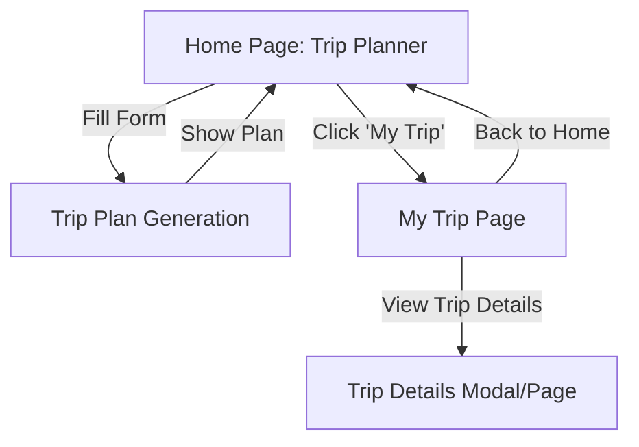

# Trip Planner (Minimal Travel UI)

A minimal, relaxed travel planning app built with Next.js and Tailwind CSS. Users can plan trips, view their saved trips, and enjoy a clean, modern, travel-inspired interface.

## Getting Started

### Environment Setup

Create a `.env.local` file in the root directory and configure your API settings:

```env
# API Configuration
NEXT_PUBLIC_API_BASE_URL=https://your-api-domain.com/api
NEXT_PUBLIC_API_TOKEN=your-api-token-here

# For Supabase Edge Functions (example):
# NEXT_PUBLIC_API_BASE_URL=https://your-project.supabase.co/functions/v1
# NEXT_PUBLIC_API_TOKEN=your-supabase-anon-key

# For local development:
# NEXT_PUBLIC_API_BASE_URL=http://localhost:3001/api
```

### Installation

First, install dependencies and run the development server:

```bash
npm install
npm run dev
```

Open [http://localhost:3000](http://localhost:3000) with your browser to see the result.

## Components

### Header Components
- **Header**: Two-tier header with top bar and main navigation
- **ActionButtons**: Reusable component for header action buttons
- **MobileMenu**: Responsive mobile navigation with contact info
- **HeroActionButtons**: Larger buttons for hero section
- **ThemeToggle**: Theme switching button with icon and text support

### Theme Components
- **ThemeProvider**: Context provider for theme management
- **ThemeToggle**: Button component for switching themes
- **Theme Types**: Light and Dark themes

### Layout Components
- **Footer**: Site footer (to be implemented)
- **Layout**: Main app layout with providers

## User Flow



---

This project uses [`next/font`](https://nextjs.org/docs/app/building-your-application/optimizing/fonts) to automatically optimize and load [Geist](https://vercel.com/font), a new font family for Vercel.

## Learn More

To learn more about Next.js, take a look at the following resources:

- [Next.js Documentation](https://nextjs.org/docs) - learn about Next.js features and API.
- [Learn Next.js](https://nextjs.org/learn) - an interactive Next.js tutorial.

You can check out [the Next.js GitHub repository](https://github.com/vercel/next.js) - your feedback and contributions are welcome!

## Deploy on Vercel

The easiest way to deploy your Next.js app is to use the [Vercel Platform](https://vercel.com/new?utm_medium=default-template&filter=next.js&utm_source=create-next-app&utm_campaign=create-next-app-readme) from the creators of Next.js.

Check out our [Next.js deployment documentation](https://nextjs.org/docs/app/building-your-application/deploying) for more details.
