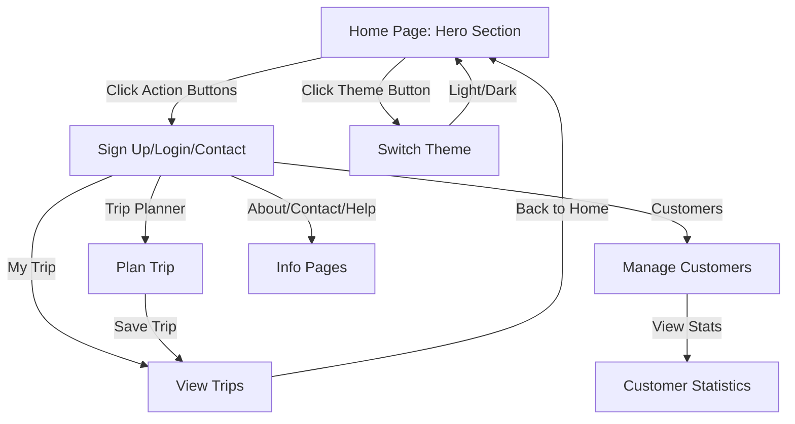

# Trip Planner (Minimal Travel UI)

A minimal, relaxed travel planning app built with Next.js and Tailwind CSS. Users can plan trips, view their saved trips, and enjoy a clean, modern, travel-inspired interface with theme switching and active navigation.

## Features

### 🎨 Design & UI
- **Custom Red Theme**: Professional red color scheme using #A54141
- **Theme Switching**: Toggle between Light and Dark themes
- **Two-Tier Header**: Top bar with contact info and main navigation
- **Active Navigation**: Visual feedback for current page with hover effects
- **Responsive Design**: Mobile-first approach with responsive components
- **Action Buttons**: Interactive buttons for "ติดต่อเรา", "สมัครสมาชิก", "เข้าสู่ระบบ"
- **Hero Section**: Engaging landing page with call-to-action buttons
- **Mobile Menu**: Hamburger menu for mobile devices with contact info
- **Dropdown Navigation**: Hover dropdown for additional information
- **Thai Language Support**: Sarabun font for Thai text rendering

### 🚀 Core Functionality
- **Trip Planning**: Create and manage travel itineraries
- **Trip Management**: View and organize saved trips
- **Customer Management**: Manage customer information and statistics
- **Modern UI**: Clean, intuitive interface with smooth animations
- **Theme Persistence**: Theme preference saved in localStorage
- **User Authentication**: Sign up and login functionality
- **Contact System**: Integrated contact form and live chat

## Recent Updates

### Build Fixes (Latest)
- ✅ Fixed unescaped apostrophe in introduction page (`We've` → `We&apos;ve`)
- ✅ Replaced `` with Next.js `<Image>` component for better performance
- ✅ Removed unused `error` variable in `useTripPlanner` hook
- ✅ All ESLint warnings and errors resolved
- ✅ Build now passes successfully with no errors or warnings
- ✅ Added Thai Sarabun font support for better Thai text rendering

## Getting Started

### Environment Setup

Create a `.env.local` file in the root directory and configure your API settings:

```env
# API Configuration
NEXT_PUBLIC_API_BASE_URL=https://your-api-domain.com/api
NEXT_PUBLIC_API_TOKEN=your-api-token-here

# For Supabase Edge Functions (example):
# NEXT_PUBLIC_API_BASE_URL=https://your-project.supabase.co/functions/v1
# NEXT_PUBLIC_API_TOKEN=your-supabase-anon-key

# For local development:
# NEXT_PUBLIC_API_BASE_URL=http://localhost:3001/api
```

### Installation

First, install dependencies and run the development server:

```bash
npm install
npm run dev
```

Open [http://localhost:3000](http://localhost:3000) with your browser to see the result.

## Pages

### Main Pages
- **Home Page** (`/`): Landing page with hero section and features
- **Trip Planner** (`/trip-planner`): Create and plan travel itineraries
- **Customers** (`/customers`): Manage customer information and statistics
- **My Trip** (`/my-trip`): View and manage saved trips
- **About** (`/about`): Company information
- **Contact** (`/contact`): Contact information
- **Help** (`/help`): Support and help center

## Components

### Header Components
- **Header**: Two-tier header with top bar and main navigation
- **ActionButtons**: Reusable component for header action buttons
- **MobileMenu**: Responsive mobile navigation with contact info
- **HeroActionButtons**: Larger buttons for hero section
- **ThemeToggle**: Theme switching button with icon and text support

### Theme Components
- **ThemeProvider**: Context provider for theme management
- **ThemeToggle**: Button component for switching themes
- **Theme Types**: Light and Dark themes

### Layout Components
- **Footer**: Site footer (to be implemented)
- **Layout**: Main app layout with providers

### Authentication Components
- **SignupPage**: User registration form with Thai language support
- **Contact**: Contact form with live chat functionality

## User Flow



## Features

### Trip Planning
- Interactive trip planning form
- Save and view trip details
- Modern, responsive UI

### Contributors
- Dynamic contributor listing from `contribute/` directory
- Server-side file reading using Next.js server actions
- Responsive grid layout with contributor cards
- Automatic sorting and error handling

### User Authentication
- Complete signup form with profile picture upload
- Form validation and error handling
- Thai language interface

## Color Scheme

The application uses a custom red theme with the following color palette:
- **Primary Red**: `#A54141` - Main brand color
- **Hover Red**: `#8B3636` - Interactive states (darker shade)
- **Light Red**: `#F5F0F0` - Background accents
- **Gradient Red**: `from-[#A54141] to-[#8B3636]` - CTA sections
- **Neutral**: Gray tones for text and borders
- **White**: Clean backgrounds and contrast

## Theme System

### Available Themes
1. **Light Theme**: Default theme with white background and dark text
2. **Dark Theme**: Dark background with light text and red accents

### Theme Features
- **Persistent Storage**: Theme preference saved in localStorage
- **Smooth Transitions**: CSS transitions for theme changes
- **Icon Indicators**: Different icons for each theme state
- **Mobile Support**: Theme toggle available in mobile menu

## Design Features

### Header Design
- **Top Bar**: Contact information and utility links
- **Main Header**: Logo, navigation, and action buttons
- **Hover Effects**: Subtle underline animations on navigation
- **Dropdown Menu**: Additional information with hover states
- **Mobile Responsive**: Collapsible menu with contact info
- **Theme Toggle**: Icon button for switching themes

### Button Styles
- **Primary**: #A54141 background with white text
- **Secondary**: #A54141 border with #A54141 text
- **Tertiary**: Text-only with hover effects
- **Consistent Spacing**: Uniform padding and margins

### Typography
- **Thai Font**: Sarabun font for Thai text with proper weight variants
- **English Font**: Geist Sans for English text
- **Monospace**: Geist Mono for code and technical content

## Navigation Features

### Active State
- **Visual Feedback**: Current page highlighted with red color and background
- **Underline Animation**: Smooth underline animation on hover and active state
- **Mobile Support**: Active state works in mobile menu
- **Dropdown Support**: Active state for dropdown menu items

### Hover Effects
- **Color Transition**: Smooth color transition on hover
- **Background Change**: Subtle background color change
- **Underline Animation**: Animated underline that appears on hover
- **Consistent Design**: Same hover effects across desktop and mobile

---

This project uses [`next/font`](https://nextjs.org/docs/app/building-your-application/optimizing/fonts) to automatically optimize and load [Geist](https://vercel.com/font) and [Sarabun](https://fonts.google.com/specimen/Sarabun) fonts.

## Learn More

To learn more about Next.js, take a look at the following resources:

- [Next.js Documentation](https://nextjs.org/docs) - learn about Next.js features and API.
- [Learn Next.js](https://nextjs.org/learn) - an interactive Next.js tutorial.

You can check out [the Next.js GitHub repository](https://github.com/vercel/next.js) - your feedback and contributions are welcome!

## Deploy on Vercel

The easiest way to deploy your Next.js app is to use the [Vercel Platform](https://vercel.com/new?utm_medium=default-template&filter=next.js&utm_source=create-next-app&utm_campaign=create-next-app-readme) from the creators of Next.js.

Check out our [Next.js deployment documentation](https://nextjs.org/docs/app/building-your-application/deploying) for more details.
